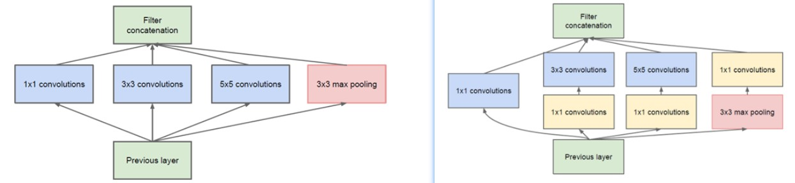

参考链接：[1×1 卷积核的作用？（附实例）](https://zhuanlan.zhihu.com/p/35814486)

## 为什么在Inception模型，1x1卷积核在池化层的后面？

例子1 : GoogleNet中的3a模块

- 输入的feature map是28×28×192

- 1×1卷积通道为64

- 3×3卷积通道为128

- 5×5卷积通道为32

左图卷积核参数：192 × (1×1×64) +192 × (3×3×128) + 192 × (5×5×32) = 387072

右图对3×3和5×5卷积层前分别加入了通道数为96和16的1×1卷积层，这样卷积核参数就变成了:

192 × (1×1×64) +（192×1×1×96+ 96 × 3×3×128）+（192×1×1×16+16×5×5×32）= 157184

**同时在并行pooling层后面加入1×1卷积层后也可以降低输出的feature map数量（feature map尺寸指W、H是共享权值的sliding window，feature map 的数量就是channels）**

左图feature map数量：64 + 128 + 32 + 192(pooling后feature map不变) = 416 （如果每个模块都这样，网络的输出会越来越大）

右图feature map数量：64 + 128 + 32 + 32(pooling后面加了通道为32的1×1卷积) = 256

GoogLeNet利用1×1的卷积降维后，得到了更为紧凑的网络结构，虽然总共有22层，但是参数数量却只是8层的AlexNet的十二分之一（当然也有很大一部分原因是去掉了全连接层）
