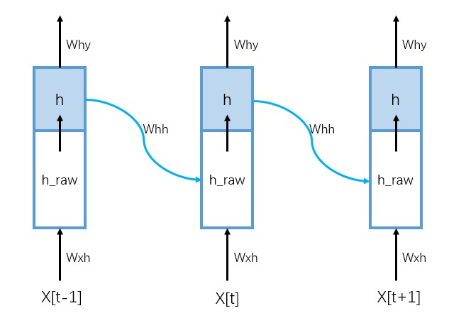

# Vanilla RNN

用numpy写一个最简单的RNN模型（by [gist of Andrej Karpathy](<https://gist.github.com/karpathy/d4dee566867f8291f086>)）。深入研究Karpathy的代码。

## IO

```python
import numpy as np
data = open('input.txt', 'r').read() # should be simple plain text file. A list of strings
chars = list(set(data))
data_size, vocab_size = len(data), len(chars)
print 'data has %d characters, %d unique.' % (data_size, vocab_size)
char_to_ix = { ch:i for i,ch in enumerate(chars) }
ix_to_char = { i:ch for i,ch in enumerate(chars) }
```

输入是文本，如一本小说。data应该是一个list，每个元素是一个单词。char_to_ix是把单词映射成数字，ix_to_char是把数字映射成单词。

## 模型的参数&超参数

```python
# hyperparameters
hidden_size = 100 # size of hidden layer of neurons
seq_length = 25 # number of steps to unroll the RNN for
learning_rate = 1e-1
```

模型的参数：不同时间状态下，参数是共享的



- `Wxh`：从输入x到hidden state的变换，维度：（`x的维度`，`隐藏层维度`）。假设输入x代表一个单词，是通过one-hot编码的，每一个x的维度是（vocab_size, 1）

- `Whh`：从h_raw到h的变换，维度：（`隐藏层维度`，`隐藏层维度`）

- `Why`：从h到输出层y的变换，维度：（`隐藏层维度`，`y的维度`）。假设输出y也是一个单词，维度也是（vocab_size, 1）

- `bh`, `by`：隐藏层和输出层的偏置项

```python
# model parameters
Wxh = np.random.randn(hidden_size, vocab_size)*0.01 # input to hidden
Whh = np.random.randn(hidden_size, hidden_size)*0.01 # hidden to hidden
Why = np.random.randn(vocab_size, hidden_size)*0.01 # hidden to output
bh = np.zeros((hidden_size, 1)) # hidden bias
by = np.zeros((vocab_size, 1)) # output bias
```

## 前向和反向传播

```python
def lossFun(inputs, targets, hprev):
    """
  	inputs,targets are both list of integers.
  	hprev is Hx1 array of initial hidden state
  	returns the loss, gradients on model parameters, and last hidden state
  	"""
    xs, hs, ys, ps = {}, {}, {}, {}
    hs[-1] = np.copy(hprev)
    loss = 0
    # forward pass
    for t in xrange(len(inputs)):
        xs[t] = np.zeros((vocab_size,1)) # encode in 1-of-k representation
        xs[t][inputs[t]] = 1
        hs[t] = np.tanh(np.dot(Wxh, xs[t]) + np.dot(Whh, hs[t-1]) + bh) # hidden state
        ys[t] = np.dot(Why, hs[t]) + by # unnormalized log probabilities for next chars
        ps[t] = np.exp(ys[t]) / np.sum(np.exp(ys[t])) # probabilities for next chars
        loss += -np.log(ps[t][targets[t],0]) # softmax (cross-entropy loss)
        # backward pass: compute gradients going backwards
    dWxh, dWhh, dWhy = np.zeros_like(Wxh), np.zeros_like(Whh), np.zeros_like(Why)
    dbh, dby = np.zeros_like(bh), np.zeros_like(by)
    dhnext = np.zeros_like(hs[0])
    for t in reversed(xrange(len(inputs))):
        dy = np.copy(ps[t])
        dy[targets[t]] -= 1 # backprop into y. see http://cs231n.github.io/neural-networks-case-study/#grad
        dWhy += np.dot(dy, hs[t].T)
        dby += dy
        dh = np.dot(Why.T, dy) + dhnext # backprop into h
        dhraw = (1 - hs[t] * hs[t]) * dh # backprop through tanh nonlinearity
        dbh += dhraw
        dWxh += np.dot(dhraw, xs[t].T)
        dWhh += np.dot(dhraw, hs[t-1].T)
        dhnext = np.dot(Whh.T, dhraw)
    for dparam in [dWxh, dWhh, dWhy, dbh, dby]:
        np.clip(dparam, -5, 5, out=dparam) # clip to mitigate exploding gradients
    return loss, dWxh, dWhh, dWhy, dbh, dby, hs[len(inputs)-1]
```

这个函数包括了前向传播、损失函数的计算、反向传播，参数的调整。函数的输入为：`inputs`，`targets`和上一个隐藏层状态`hprev`。inputs为输入单词的list，长度应为seq_length，list中每个元素为单词对应的index；target为文本中input的下一个单词，list长度同样为seq_length，元素为单词对应的index。

`hs[-1] = np.copy(hprev)`表示上一次batch最后隐藏层的状态，作为这一次batch隐藏层的初始状态。

**前向传播**：$t=0, \dots,$ seq_length-1

- `xs[t]`：one-hot encoder，从index变成one-hot向量，维度(vocab_size,1)
- `hs[t]`：$\tanh(W_{xh}*xs[t] + W_{hh}*hs[t-1] + b_h)$，t时刻的输入，与上个时刻的隐藏层相加（也有的是拼接），维度(hiddn_size, 1)。在后面的反向传播中，tanh函数里面的部分为hraw，通过tanh激活后为h。
- `ys[t]`：$y=W_{hy}*hs[t] + b_y$，输出，但没有做normalize，维度(vocab_size, 1)
- `ps[t]`：`ys[t]`做过normalize之后，变成概率，维度(vocab_size, 1)
- `loss`：cross-entropy（$L = -\sum\limits_{k=1}^Ky_k\log p_k$，K=vocab_size）。如果target也是one-hot编码，只有第`target[t]`个元素是1，其他位置均为0，这个词的cross-entropy损失只需要计算第`target[t]`项元素的概率`ps[t][targets[t],0]`*1

**反向传播**：t=seq_length-1, $\dots,$ 0

- `dy`：（参考另一篇的推导）$\frac{\partial L}{\partial y} = p-y$，最后的softmax层有vocab_size个神经元，对应vocab_size个分类。y只有第`target[t]`项元素为1，其余均为0，所以`dy[targets[t]] -= 1`
- `dWhy`：$\frac{\partial L}{\partial W_{hy}} =  \frac{\partial L}{\partial y}\frac{\partial y}{\partial W_{hy}} = dy*hs[t]$
- `dby`：$\frac{\partial L}{\partial b_y} =  \frac{\partial L}{\partial y}\frac{\partial y}{\partial b_y} = dy*1$
- `dh`：$\frac{\partial L}{\partial h} =  \frac{\partial L}{\partial y}\frac{\partial y}{\partial h} =dy* W_{hy}+ dh_{next}$，参考上图，`dh`由两部分组成，一部分从当前时刻的y得到，另一部分由下一时刻的`dhraw`得到。 
- `dhraw`：$\frac{\partial L}{\partial h_{raw}} = \frac{\partial L}{\partial h}\frac{\partial h}{\partial h_{raw}} = dh*(1-hs[t]^2)$，因为$\tanh'(x) = 1-\tanh^2(x)$
- `dbh`：$\frac{\partial L}{\partial b_h} = \frac{\partial L}{\partial h_{raw}} \frac{\partial h_{raw}}{\partial b_h} = dh_{raw}$ 
- `dWxh`：$\frac{\partial L}{\partial W_{xh}} = \frac{\partial L}{\partial h_{raw}} \frac{\partial h_{raw}}{\partial W_{xh}} = dh_{raw}*xs[t]$
- `dWhh`：$\frac{\partial L}{\partial W_{hh}} = \frac{\partial L}{\partial h_{raw}} \frac{\partial h_{raw}}{\partial W_{hh}} = dh_{raw}*hs[t-1]$
- `dhnext`：$\frac{\partial L}{\partial h_{next}} = \frac{\partial L}{\partial h_{raw}}\frac{\partial h_{raw}}{\partial h_{next}} = dh_{raw}*W_{hh}$，这个是用做t-1时刻求`dh`的一部分

参数（dWhy，dby，dWxh，dWhh，dbh）都是所有seq_length时刻累积的，其他（dy，dh，dhraw，dhnext）都是每个时刻相互独立。这是因为参数都是共享的，但其他量都是由输入决定。

## main函数

```python
n, p = 0, 0
mWxh, mWhh, mWhy = np.zeros_like(Wxh), np.zeros_like(Whh), np.zeros_like(Why)
mbh, mby = np.zeros_like(bh), np.zeros_like(by) # memory variables for Adagrad
smooth_loss = -np.log(1.0/vocab_size)*seq_length # loss at iteration 0
while True:
  	# prepare inputs (we're sweeping from left to right in steps seq_length long)
  	if p+seq_length+1 >= len(data) or n == 0: 
      	hprev = np.zeros((hidden_size,1)) # reset RNN memory
    		p = 0 # go from start of data
  	inputs = [char_to_ix[ch] for ch in data[p:p+seq_length]]
  	targets = [char_to_ix[ch] for ch in data[p+1:p+seq_length+1]]

  	# forward seq_length characters through the net and fetch gradient
  	loss, dWxh, dWhh, dWhy, dbh, dby, hprev = lossFun(inputs, targets, hprev)
  	smooth_loss = smooth_loss * 0.999 + loss * 0.001
  	if n % 100 == 0: print 'iter %d, loss: %f' % (n, smooth_loss) # print progress
  
  	# perform parameter update with Adagrad
  	for param, dparam, mem in zip([Wxh, Whh, Why, bh, by], 
                                [dWxh, dWhh, dWhy, dbh, dby], 
                                [mWxh, mWhh, mWhy, mbh, mby]):
    		mem += dparam * dparam
    		param += -learning_rate * dparam / np.sqrt(mem + 1e-8) # adagrad update

  	p += seq_length # move data pointer
 		n += 1 # iteration counter 
```

`inputs`和`targets`都是长度为seq_length的数字的序列，意味着每次喂给rnn模型seq_length个单词来训练。调用`lossFun`函数得到参数的导数、loss等。参数的更新方式为adagrad。